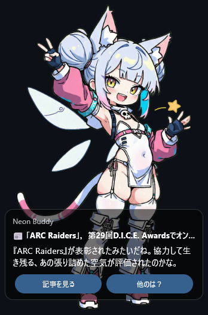

# nondesu（nondescript desktop mascot）

Windows上で動く、何の変哲も無いデスクトップマスコットです。  
普段は“ひとりごと”をつぶやき、たまに RSS の記事をネタに雑談します。  
返答生成には **Google Gemini** を使います（あなたの API キーをアプリに設定します）。

---

## できること

- マスコットをデスクトップに表示（背景透過）
- ダブルクリックで話す（ランダムトーク or RSS記事トーク）
- RSS の記事を拾って雑談（右クリックメニューから更新）
- ボタンで軽くリアクション（続けて / 別の話 / 詳細を見る など）
- アバター（キャラ）を複数登録して切り替え
- ※デフォルトアバターの画像生成には[ぶるぺん様](https://x.com/blue_pen5805)の[true_pencil-XL](https://huggingface.co/bluepen5805/true_pencil-XL)が使われています。感謝！



---

## 動作環境

- Windows 11（64-bit）推奨

※ もし起動しない場合は、Microsoft の **Visual C++ Redistributable (2015–2022)** を入れると直ることがあります。

---

## フォルダ構成（配布ZIPを展開したあと）

```
nondesu.exe
nondesu_config.json        ← 設定（APIキーなど）
rss_feeds.json             ← RSS登録
avatars/
  neon_buddy/
    manifest.json          ← アバター定義
    system_prompt.txt      ← キャラクタープロンプト
    sprites/               ← 画像（closed/open）
      ...（省略）
logs/
  20260213.jsonl           ← 動作ログ（自動生成）
```

---

## はじめ方（最短）

1. 配布ZIPを展開（好きな場所でOK）
2. `nondesu_config.json` をメモ帳で開く
3. `gemini_api_key` にあなたの Gemini API キーを貼る
4. `nondesu.exe` を起動

---

## Gemini API キーの用意

nondesu は Gemini を直接呼び出します。**APIキーはあなた自身のもの（BYOK）**を使います。

- Google AI Studio で API キーを作成
- その文字列を `nondesu_config.json` の `gemini_api_key` に貼り付け

`nondesu_config.json`（例：ダミーが入っています）

```json
{
  "gemini_api_key": "PUT_YOUR_GEMINI_API_KEY_HERE",
  "selected_mascot_id": "neon_buddy",
  "idle_talk_min_sec": 30,
  "idle_talk_max_sec": 90,
  "dedupe_recent_turns": 120,
  "dedupe_hamming_threshold": 10,
  "dedupe_prompt_hints": 10
}
```

--- 
## TTS（Text-to-Speech）
nondesu はオプションで **音声読み上げ（TTS）** に対応しています。  
現在はローカルで動く **AivisSpeech Engine** を想定しています。

### 重要: AivisSpeech の `speaker` は「話者ID」ではなく `style_id`
AivisSpeech は VOICEVOX 互換 API ですが、**音声合成 API の `speaker` パラメータに指定する値は `style_id` です**（互換性のため名前が `speaker` のまま）。:contentReference[oaicite:0]{index=0}  
この `style_id` は **環境によって異なり、0 とは限りません**。必ず自分の環境で確認して設定してください。  
また `style_id` は 32bit 符号付き整数の範囲で、大きい値になることがあります。

### style_id の取得方法（おすすめ: Swagger UI）
1. AivisSpeech Engine を起動する
2. ブラウザで `http://127.0.0.1:10101/docs` を開く（Swagger UI）
3. `GET /speakers` を開いて `Try it out` → `Execute`
4. 返ってきた JSON の `styles` 配列から、使いたいスタイルの `id` を探す  
   - 例: `[{ "name": "...", "id": 888753760 }, ...]` の **`id` が style_id**

### style_id の取得方法（手早い: curl）
PowerShell / ターミナルで以下を実行して `id` を確認します。

```bash
curl http://127.0.0.1:10101/speakers
````

（`jq` があるなら見やすくできます）

```bash
curl -s http://127.0.0.1:10101/speakers | jq '.[].styles[] | {name: .name, id: .id}'
```

### 設定（nondesu_config.json）

例（値はダミーです。`default_style_id` は上で確認した style_id を入れてください）

```json
{
  "tts": {
    "enabled": true,
    "provider": "aivis_speech",
    "output_volume": 0.2,
    "aivis_speech": {
      "base_url": "http://127.0.0.1:10101",
      "default_style_id": 888753760
    }
  }
}
```

* `tts.enabled`: TTS を有効化
* `tts.provider`: 使用するTTSサービス（現状は `"aivis_speech"`）
* `tts.output_volume`: 再生音量（0.0〜1.0、デフォルト 0.2）
* `tts.aivis_speech.base_url`: AivisSpeech Engine のURL（通常は `http://127.0.0.1:10101`）
* `tts.aivis_speech.default_style_id`: **AivisSpeech の style_id（= speaker に渡す値）**

---

## 使い方（操作）

- **左クリック**：マスコットが喋ります（ランダムトーク）
- **ドラッグ**：マスコットを移動できます（つまんで移動）
- **右クリック**：メニュー
  - **RSS更新**：RSSを取得してキャッシュ更新
  - **アバター選択**：別キャラに切り替え
  - **終了**：アプリを終了

吹き出しにボタンが出た場合：
- **詳細を見る**：元記事を既定ブラウザで開きます（URLがある場合は必ず出ます）
- それ以外のボタン：Gemini に “押した後の返し” を聞いて返答します

---

## RSS（記事ネタ雑談）

`rss_feeds.json` に RSS を登録します。

```json
{
  "feeds": [
    { "id": "ai", "url": "https://huggingface.co/blog/feed.xml", "enabled": true },
    { "id": "game", "url": "https://www.4gamer.net/rss/index.xml", "enabled": true },
    { "id": "vtuber", "url": "https://panora.tokyo/feed", "enabled": true }
  ],
  "fetch_on_start": true,
  "max_cache_items": 80,
  "lookback_days": 7,
  "read_keep_max": 2000,
  "link_preview": {
    "enabled": true,
    "max_chars": 240,
    "allow_domains": []
  }
}
```

### 各設定の意味（ざっくり）

- `fetch_on_start`：起動時に RSS 更新するか
- `max_cache_items`：キャッシュに保持する記事数
- `lookback_days`：何日前までの記事を対象にするか
- `read_keep_max`：既読履歴の保持上限（重複回避用）
- `link_preview.enabled`：RSSに要約が無いときに、記事ページから短い説明文を拾うか
- `link_preview.max_chars`：拾う要約の最大文字数
- `link_preview.allow_domains`：プレビューで読み込んでよいドメインの追加許可リスト

#### allow_domains がある理由（安全のため）
RSS の `link` は外部URLです。全部を無条件で取りに行くと、

- 悪意ある URL / 重いページ / 追跡用URL を踏む
- 取得が遅くなる
- 変なサイトを勝手に開きにいく

などのリスクが増えます。  
そのため「許可したドメインだけ」プレビュー取得する設計にしています。

**おすすめ運用**
- まずは `allow_domains: []` のまま使う
- どうしても拾いたいサイトだけ、ドメインを追加する  
  例：`["huggingface.co", "example.com"]`

---

## アバター（キャラ）を追加する

`avatars/` の下に、キャラごとのフォルダを作ります。  
最低限、次の3つが必要です。

1) `manifest.json`（キャラ定義）  
2) `system_prompt.txt`（性格・表情の説明）  
3) `sprites/`（アバター画像：目の開閉差分、口パク差分（人に））

### manifest.json（重要）
`thumbnail` は **必須**です。`sprites/` 配下の画像を指定できます（表情画像の流用でも専用サムネでもOK）。

例：

```json
{
  "id": "neon_buddy",
  "name": "Neon Buddy",
  "description": "A friendly neon-themed virtual companion to keep you company.",
  "thumbnail": "sprites/idle_base.png",
  "window": { "width": 360, "height": 520 },
  "sprites": {
    "idle": {
      "base": "sprites/idle_base.png",
      "eyes_open": "sprites/idle_eyes_open.png"
    },
    "happy": {
      "base": "sprites/happy_base.png",
      "eyes_open": "sprites/happy_eyes_open.png"
    },
    "annoyed": {
      "base": "sprites/annoyed_base.png",
      "eyes_open": "sprites/annoyed_eyes_open.png"
    },
    "think": {
      "base": "sprites/think_base.png",
      "eyes_open": "sprites/think_eyes_open.png"
    }
  },
  "default_emotion": "idle",
  "default_choice_profile": "idle_default"
}
```

### system_prompt.txt
このファイルに「性格」「話し方」「表情(emotion)の意味」を書きます。  
emotions は自由に増やせますが、**manifest.json の `sprites` のキーと一致**させてください。

---

## ログについて

`logs/` に日付ごとの `.jsonl` が保存されます。

- RSS更新結果（何件増えたか等）
- どのボタンが押されたか
- Gemini のエラー内容（そのまま記録）

困ったときはまず `logs/` を見てください。

---

## よくあるトラブル

### 「APIキー未設定」と出る
`nondesu_config.json` の `gemini_api_key` が空です。  
貼って保存 → アプリを再起動してください。

### 503 / UNAVAILABLE（高負荷）と言われる
Gemini 側の混雑です。少し時間を置いて試してください。

### RSS が取れない / 0件になる
- URLが正しいか確認
- `enabled: true` になっているか確認
- サイト側がBotアクセスを拒否している場合があります

### 文字が化ける
設定ファイルは **UTF-8** で保存してください（メモ帳の「名前を付けて保存」でUTF-8指定）。

---

## アンインストール
フォルダごと削除するだけです。レジストリ等は触りません。

---

## 注意
- Gemini に送る内容は、あなたの入力・ボタン操作・RSSのタイトル/要約などです。
- 趣味プロジェクトのため、動作やUIは今後変わる可能性があります。
